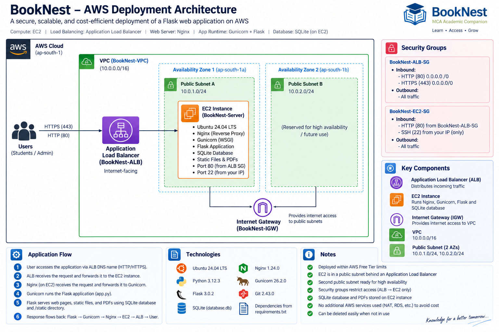

# BookNest – MCA Academic Companion

> AWS cloud deployment of a Flask-based academic resource platform using an internet-facing Application Load Balancer, Amazon EC2, Nginx, Gunicorn, and SQLite.

[](https://aws.amazon.com/)
[](https://www.python.org/)
[](https://flask.palletsprojects.com/)
[](LICENSE)

## 1. Project Overview

BookNest – MCA Academic Companion is a Flask web application for organizing MCA academic resources by semester and subject. Users enter their name and an approved institute email address, browse semester-wise subjects, and download available PDF resources. An administrator can upload or replace PDF resources through a protected management page.

The application is deployed as a Linux web workload on AWS:

```text
Internet users
      |
      v
Internet-facing Application Load Balancer :80
      |
      v
Target Group -> EC2 :80
      |
      v
Nginx reverse proxy :80
      |
      v
Gunicorn :8000
      |
      v
Flask application
      |
      +---- SQLite database (database.db)
      |
      +---- PDF binary data stored in SQLite
```

This repository documents the actual application and the AWS deployment pattern used for the project. It intentionally does not introduce RDS, S3, NAT Gateway, Auto Scaling, CloudFront, WAF, or other services that were not part of the implemented deployment.

## 2. Problem Statement

Academic PDF resources can become difficult for students to find when they are distributed across multiple locations. BookNest provides a single web interface where resources are organized by MCA semester and subject.

From a cloud-engineering perspective, the project also demonstrates how a Python web application can be moved from a local development environment to an AWS-hosted Linux server behind an Application Load Balancer.

## 3. Objectives

- Build a simple academic resource portal with Flask.
- Restrict normal access to approved institute email addresses.
- Provide semester-wise subject navigation.
- Allow an administrator to upload PDF resources.
- Persist application data in SQLite.
- Deploy the application on Ubuntu EC2.
- Run Flask through Gunicorn rather than the Flask development server.
- Use Nginx as a reverse proxy.
- Place the application behind an internet-facing Application Load Balancer.
- Use a custom VPC, public subnets, route table, Internet Gateway, and security groups.
- Keep the initial architecture simple and cost-conscious.

## 4. Key Features

### User features

- Name and institute-email validation.
- Session-based login state.
- Semester selection.
- Subject-wise resource listing.
- PDF download.
- User-friendly flash messages for invalid input and unavailable resources.

### Administrator features

- Administrator identification by configured email address.
- Protected management page.
- Subject selection.
- PDF upload.
- PDF replacement/update.

### Application implementation

- Python 3.12 runtime.
- Flask 3.0.2.
- Flask-SQLAlchemy 3.1.1.
- SQLite.
- Gunicorn 26.2.0.
- Nginx 1.24.0 on Ubuntu.
- Git/GitHub source control.

## 5. Architecture

### 5.1 High-level architecture



The architecture contains:

| Layer | Component | Purpose |
|---|---|---|
| Client | Web browser | Accesses the BookNest application |
| Edge | Application Load Balancer | Internet-facing entry point and HTTP request distribution |
| Network | `BookNest-VPC` | Isolated AWS network |
| Network | Public Subnet A | `10.0.1.0/24`, `ap-south-1a`; hosts EC2 |
| Network | Public Subnet B | `10.0.2.0/24`, `ap-south-1b`; second ALB subnet |
| Network | Internet Gateway | Internet connectivity for public subnets |
| Routing | `BookNest-Public-RT` | Routes VPC-local traffic and `0.0.0.0/0` to the IGW |
| Compute | `BookNest-Server` | Ubuntu EC2 application host |
| Web tier | Nginx | Receives HTTP on EC2 port 80 and reverse-proxies to Gunicorn |
| App server | Gunicorn | WSGI server on `127.0.0.1:8000` |
| Application | Flask | Handles routes, sessions, validation, uploads, downloads |
| Data | SQLite `database.db` | Stores application records and PDF binary data |
| Security | `BookNest-ALB-SG` | Allows public HTTP 80 to the ALB |
| Security | `BookNest-EC2-SG` | Allows HTTP 80 from the ALB security group and SSH 22 from the administrator's IP |

### 5.2 Network design

Region:

```text
<AWS_REGION>
```

The implemented project used the Mumbai region:

```text
ap-south-1
```

VPC:

```text
BookNest-VPC
10.0.0.0/16
```

Subnets:

```text
BookNest-Public-Subnet-A
10.0.1.0/24
ap-south-1a

BookNest-Public-Subnet-B
10.0.2.0/24
ap-south-1b
```

EC2 is placed in Public Subnet A. The ALB is configured across both public subnets so it has subnet coverage in two Availability Zones.

No NAT Gateway is required by this architecture because the EC2 instance is in a public subnet and has direct Internet Gateway connectivity.

### 5.3 Security boundaries

The ALB and EC2 use separate security groups.

**BookNest-ALB-SG**

```text
Inbound:
HTTP TCP 80 from 0.0.0.0/0

Outbound:
All traffic
```

**BookNest-EC2-SG**

```text
Inbound:
HTTP TCP 80 from BookNest-ALB-SG
SSH TCP 22 from the administrator's current public IP

Outbound:
All traffic
```

The important principle is that the EC2 HTTP rule does not expose port 80 directly to the entire Internet. Public application traffic enters through the ALB.

### 5.4 Request flow

1. A user opens the ALB DNS name in a browser.
2. The internet-facing ALB receives HTTP traffic on port 80.
3. The ALB forwards the request to `BookNest-TG`.
4. The target group sends the request to the registered EC2 instance on port 80.
5. Nginx listens on EC2 port 80.
6. Nginx reverse-proxies the request to Gunicorn on `127.0.0.1:8000`.
7. Gunicorn runs the Flask WSGI application.
8. Flask reads/writes application data in SQLite.
9. PDF data is stored in the SQLite `LargeBinary` field and returned through the download endpoint.
10. The response travels back through Gunicorn, Nginx, the target group, the ALB, and finally to the user.

### 5.5 Health check

The target group uses:

```text
Protocol: HTTP
Port: 80
Path: /
```

The Flask landing route is available at `/`, making it suitable as the target health-check endpoint.

### 5.6 Data model

The application uses a `Document` SQLAlchemy model containing:

- `id`
- `semester`
- `subject`
- `filename`
- `data` (`LargeBinary`)
- `mimetype`
- `updated_at`

The application creates the SQLite schema at startup and ensures configured subject rows exist.

### 5.7 IAM

No custom EC2 IAM role or application IAM integration was part of the implemented architecture.

If IAM is added in a future version, use least-privilege IAM roles rather than static AWS access keys on the server.

### 5.8 Monitoring and logging

The documented deployment does not include a custom CloudWatch dashboard, alarm, or centralized application-log pipeline.

Operational logs are available locally through:

```bash
sudo journalctl -u booknest
sudo journalctl -u nginx
```

Nginx access/error logs are normally available under:

```text
/var/log/nginx/
```

CloudWatch monitoring, centralized logs, alarms, and tracing are listed as future improvements rather than implemented components.

## 6. Repository Structure

```text
BookNest-MCA-Academic-Companion/
├── README.md
├── .gitignore
├── LICENSE
├── requirements.txt
├── app.py
│
├── architecture/
│   └── booknest-aws-architecture.png
│
├── screenshots/
│   ├── 01-aws-vpc.png
│   ├── 02-internet-gateway.png
│   ├── 03-public-subnets.png
│   ├── 04-route-table.png
│   ├── 05-ec2-security-group.png
│   ├── 06-ec2-instance.png
│   ├── 07-ssh-connected.png
│   ├── 08-server-tools.png
│   ├── 09-python-dependencies.png
│   ├── 10-database-restored.png
│   ├── 11-gunicorn-service.png
│   ├── 12-nginx-service.png
│   ├── 13-alb-security-group.png
│   ├── 14-target-group-healthy.png
│   ├── 15-alb-active.png
│   ├── 16-live-login.png
│   ├── 17-welcome-page.png
│   ├── 18-semester-page.png
│   ├── 19-pdf-download.png
│   └── 20-admin-upload.png
│
├── src/
│   └── README.md
│
├── infrastructure/
│   └── README.md
│
├── scripts/
│   └── README.md
│
├── configuration/
│   └── examples/
│       └── .env.example
│
└── docs/
    ├── AWS-DEPLOYMENT.md
    ├── SCREENSHOTS.md
    ├── SECURITY.md
    └── TROUBLESHOOTING.md
```

> `database.db` should remain local/server-side and must not be committed to GitHub because it contains application data and uploaded PDF content.

## 7. Prerequisites

### Local machine

- Windows, Linux, or macOS.
- Python 3.12 recommended.
- Git.
- An AWS account with access to EC2, VPC, and Elastic Load Balancing.
- SSH client.
- A GitHub account if publishing the repository.

### AWS knowledge

The project is easier to reproduce if you understand:

- VPCs and CIDR notation.
- Public subnets.
- Route tables.
- Internet Gateways.
- Security groups.
- EC2.
- Application Load Balancers.
- Linux SSH.
- Nginx reverse proxying.
- Gunicorn/WSGI.

## 8. Local Application Setup

### Step 1 — Clone the repository

Run on your local machine:

```bash
git clone https://github.com/<YOUR_GITHUB_USERNAME>/<YOUR_REPOSITORY>.git
cd <YOUR_REPOSITORY>
```

### Step 2 — Create a virtual environment

Windows PowerShell:

```powershell
py -m venv .venv
.\.venv\Scripts\Activate.ps1
```

Linux/macOS:

```bash
python3 -m venv .venv
source .venv/bin/activate
```

### Step 3 — Install dependencies

```bash
python -m pip install --upgrade pip
pip install -r requirements.txt
```

### Step 4 — Configure the secret key

For local development, the application supports the `SECRET_KEY` environment variable.

PowerShell:

```powershell
$env:SECRET_KEY="<GENERATE_A_RANDOM_SECRET>"
```

Linux/macOS:

```bash
export SECRET_KEY="<GENERATE_A_RANDOM_SECRET>"
```

A secret can be generated with:

```bash
python -c "import secrets; print(secrets.token_hex(32))"
```

### Step 5 — Run locally

```bash
python app.py
```

Open:

```text
http://127.0.0.1:5000
```

Do not use Flask's development server as the production server.

## 9. Production Deployment

The complete deployment procedure is documented in:

**[docs/AWS-DEPLOYMENT.md](docs/AWS-DEPLOYMENT.md)**

The deployment sequence is:

```text
1. Create VPC
2. Create Internet Gateway
3. Create two public subnets
4. Create and associate public route table
5. Create EC2 security group
6. Launch EC2
7. SSH into EC2
8. Install Python, venv, Git, Nginx
9. Clone the application
10. Create Python virtual environment
11. Install requirements
12. Restore database.db securely
13. Create Gunicorn systemd service
14. Configure Nginx
15. Create ALB security group
16. Restrict EC2 HTTP to the ALB security group
17. Create target group
18. Register EC2
19. Create internet-facing ALB
20. Test target health
21. Test the application through the ALB DNS name
```

## 10. Configuration

The application reads:

```text
SECRET_KEY
```

Example:

```env
SECRET_KEY=<RANDOM_SECRET>
```

Never commit the real value.

The current application also contains the configured administrator email and institute email-domain rule in `app.py`. If the project is intended for a different institution, change those values before deployment rather than exposing additional credentials.

## 11. Testing and Verification

### Application

Verify:

- Landing page loads.
- Invalid email is rejected.
- Approved institute email is accepted.
- Welcome page loads.
- Semester pages load.
- Subjects are displayed.
- Available PDF can be downloaded.
- Missing PDF produces the expected message.
- Non-admin users cannot access `/manage`.
- Admin user can access `/manage`.
- Admin can upload a PDF.
- Uploaded PDF can be downloaded.

### Server

On EC2:

```bash
sudo systemctl status booknest
sudo systemctl status nginx
curl http://127.0.0.1:8000/
curl http://127.0.0.1/
```

### Load balancer

Verify:

- ALB state is `active`.
- Target group target is `healthy`.
- ALB DNS name returns the application.
- Requests reach the EC2 instance.

## 12. Expected Result

A successful deployment provides:

```text
http://<ALB-DNS-NAME>
```

The URL should display the BookNest login page.

The target group should report the EC2 target as:

```text
healthy
```

## 13. Monitoring and Logging

For the implemented deployment:

```bash
sudo systemctl status booknest
sudo journalctl -u booknest
sudo systemctl status nginx
sudo journalctl -u nginx
```

Nginx logs:

```bash
sudo ls -lah /var/log/nginx/
```

For a future production-oriented version, consider:

- Amazon CloudWatch Agent.
- CloudWatch Logs.
- CloudWatch alarms.
- ALB access logs.
- Application metrics.
- Centralized error tracking.

These are not required components of the current architecture.

## 14. Security Considerations

### Implemented controls

- EC2 SSH restricted to the administrator's IP.
- EC2 HTTP restricted to the ALB security group.
- Separate ALB and EC2 security groups.
- Application secret supports environment-variable configuration.
- Production application served through Gunicorn and Nginx.
- No AWS access keys are required by the application.

### Never commit

```text
AWS access keys
AWS secret keys
passwords
API tokens
.env files containing secrets
private SSH keys
.pem files
private certificates
Terraform state files
Terraform plan files containing secrets
database.db
production logs containing sensitive information
```

See [docs/SECURITY.md](docs/SECURITY.md).

## 15. Cost Considerations

The architecture intentionally avoids services that were not required for the project, including:

- NAT Gateway
- RDS
- CloudFront
- WAF
- Auto Scaling
- Additional managed databases
- Additional storage services

AWS pricing and Free Tier/credit terms change over time. Always check the current AWS Billing console and AWS pricing documentation before deploying.

Do not treat an AWS credit balance as permission to leave infrastructure running indefinitely.

After testing, delete resources that are no longer required. See the cleanup section below.

## 16. Cleanup

The deployment cleanup order is:

```text
1. Delete Application Load Balancer
2. Delete Target Group
3. Terminate EC2 instance
4. Delete ALB security group
5. Delete EC2 security group
6. Delete public subnets
7. Delete public route table
8. Detach Internet Gateway
9. Delete Internet Gateway
10. Delete VPC
11. Verify Billing/Cost Management and remaining resources
```

Do not delete:

- Your local project.
- Your GitHub repository.
- Your database backup unless you intentionally want to remove it.
- Documentation and screenshots.

## 17. Troubleshooting

### ALB target is unhealthy

Check:

```bash
sudo systemctl status nginx
sudo systemctl status booknest
curl http://127.0.0.1:8000/
curl http://127.0.0.1/
```

Then verify:

- Target group uses HTTP port 80.
- Health check path is `/`.
- EC2 security group allows HTTP 80 from `BookNest-ALB-SG`.
- Nginx is listening on port 80.

### Nginx returns 502 Bad Gateway

Check Gunicorn:

```bash
sudo systemctl status booknest
sudo journalctl -u booknest --no-pager
```

Check:

```bash
curl http://127.0.0.1:8000/
```

If this fails, troubleshoot Gunicorn/Flask before troubleshooting Nginx.

### Gunicorn service fails

Check:

```bash
sudo systemctl status booknest
sudo journalctl -u booknest -n 100 --no-pager
```

Verify:

```text
WorkingDirectory
ExecStart
virtual-environment path
SECRET_KEY
application module name: app:app
```

### PDF files are missing

Verify:

```bash
ls -lh database.db
file database.db
```

The deployed application expects its SQLite database at:

```text
/home/ubuntu/BookNest/BookNest-MCA-Academic-Companion/database.db
```

Do not replace the database accidentally if it contains uploaded resources.

## 18. Screenshots

The complete screenshot plan is documented in:

**[docs/SCREENSHOTS.md](docs/SCREENSHOTS.md)**

Recommended README presentation:

### AWS Infrastructure

| Screenshot | Purpose |
|---|---|
| VPC | Shows custom VPC and CIDR |
| Subnets | Shows both public subnets/AZs |
| Route table | Shows Internet Gateway route |
| Security groups | Shows ALB-to-EC2 restriction |
| EC2 | Shows running server configuration |
| Target group | Shows healthy target |
| ALB | Shows active load balancer |

### Application

| Screenshot | Purpose |
|---|---|
| Live login | Shows ALB URL and application |
| Welcome page | Shows authenticated session |
| Semester page | Shows resource navigation |
| PDF download | Demonstrates resource delivery |
| Admin upload | Demonstrates administrator workflow |

## 19. Architecture Diagram

The source architecture diagram is stored at:

```text
architecture/booknest-aws-architecture.png
```

The diagram is intended to be the single visual source of truth for the implemented architecture. If the infrastructure changes, update the diagram and documentation together.

## 20. Future Improvements

The following are intentionally not part of the current implementation:

### Infrastructure

- Terraform or AWS CloudFormation.
- Private application subnets.
- NAT/egress architecture where required.
- Multi-instance EC2 deployment.
- Auto Scaling.
- Separate database tier.

### Storage

- Amazon RDS for relational data.
- Amazon S3 for PDF/object storage.
- Database backup strategy.

### Security

- HTTPS with ACM and a managed domain.
- AWS Systems Manager Session Manager instead of SSH.
- IAM roles with least privilege.
- AWS WAF where justified.
- Secrets Manager or Parameter Store.

### Operations

- CloudWatch logs and alarms.
- ALB access logging.
- Centralized observability.
- CI/CD using GitHub Actions or another pipeline.
- Infrastructure as Code.
- Automated deployment and rollback.

These improvements would move the architecture toward a more production-oriented platform without falsely representing them as components of the current project.

## 21. Project Completion Checklist

### Application

- [ ] Flask application runs locally.
- [ ] Requirements are documented.
- [ ] Admin workflow tested.
- [ ] PDF upload/download tested.
- [ ] `database.db` is excluded from Git.

### AWS

- [ ] VPC configured.
- [ ] Two public subnets configured.
- [ ] Internet Gateway configured.
- [ ] Route table configured.
- [ ] EC2 deployed.
- [ ] EC2 security group restricted.
- [ ] Nginx configured.
- [ ] Gunicorn configured.
- [ ] ALB security group configured.
- [ ] Target group configured.
- [ ] ALB configured.
- [ ] Target health verified.
- [ ] ALB DNS endpoint tested.

### Documentation

- [ ] Architecture diagram added.
- [ ] AWS screenshots added.
- [ ] Application screenshots added.
- [ ] Deployment guide completed.
- [ ] Security documentation completed.
- [ ] Troubleshooting documentation completed.
- [ ] Cleanup procedure documented.

### GitHub

- [ ] `.gitignore` created.
- [ ] No secrets committed.
- [ ] No `.pem` files committed.
- [ ] No `.env` files containing secrets committed.
- [ ] No `database.db` committed.
- [ ] README verified.
- [ ] Git history reviewed.
- [ ] Remote configured.
- [ ] Repository pushed.
- [ ] Published repository checked in a browser.

## 22. Author

**Author:** `Raviteja`

**GitHub:** `https://github.com/Raviteja873`

**Project:** BookNest – MCA Academic Companion

---

## Disclaimer

This repository documents a learning/portfolio architecture. AWS service availability, pricing, Free Tier rules, and console interfaces can change. Verify current AWS documentation and pricing before deploying.
